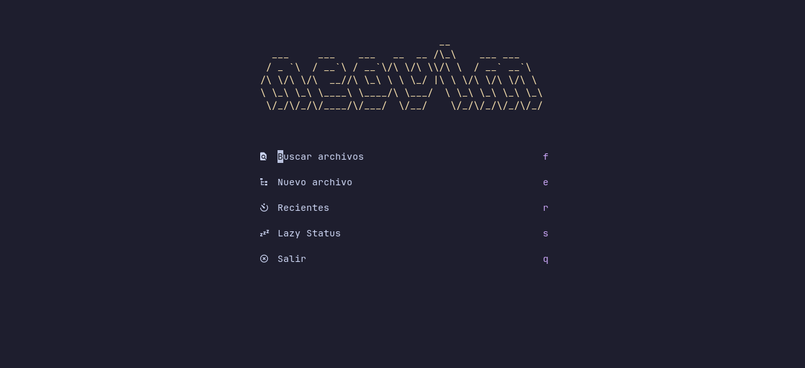
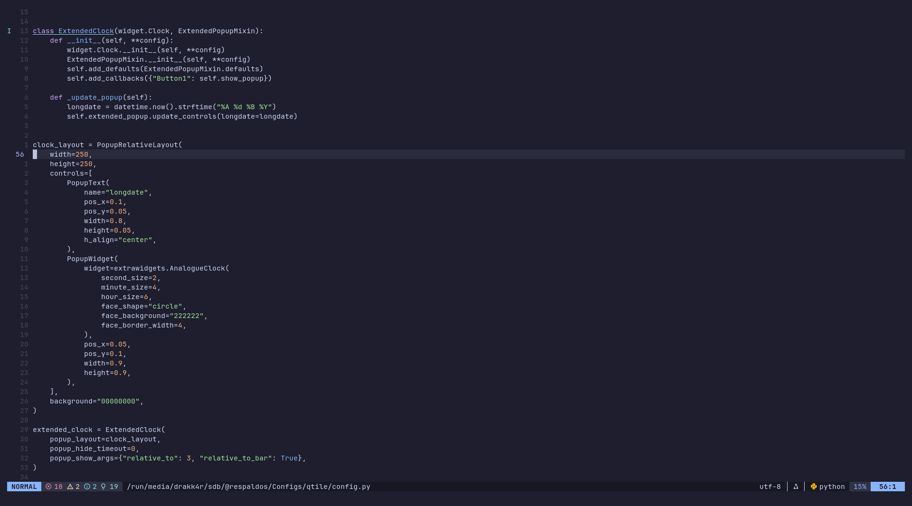
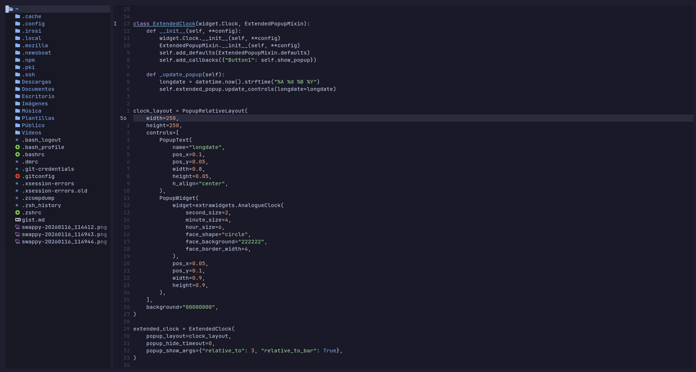
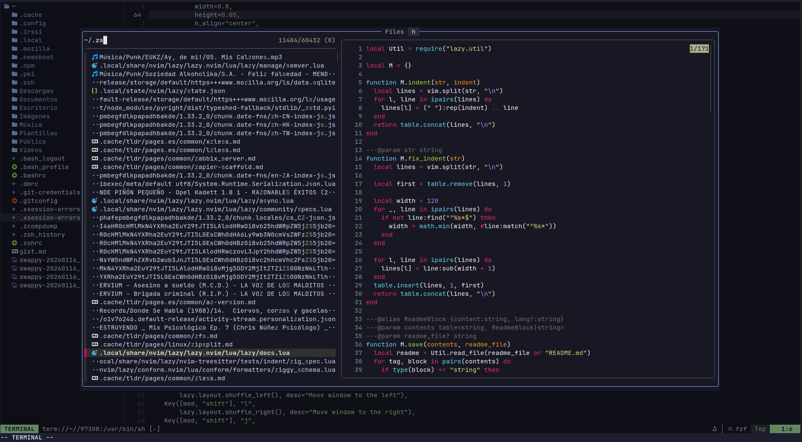
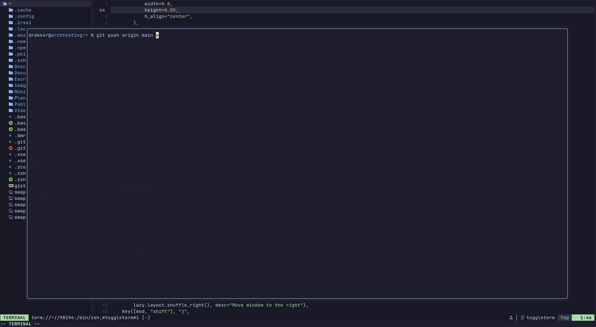

# dot-nvim-modular

Configuración de Neovim modular escrita en Lua, diseñada específicamente para **Arch Linux**.

---

## 🚀 Componentes Principales

* **Gestor**: `lazy.nvim` para una carga rápida y gestión de dependencias.
* **Buscador**: `fzf-lua` con previsualización vía `bat` e integración de diffs con `delta`.
* **Explorador**: `Neo-tree` (v3.x) con monitorización de archivos vía `libuv`.
* **LSP & Sintaxis**: `nvim-treesitter` para análisis sintáctico incremental.
* **Estética**: Tema `Catppuccin Mocha` con una `lualine` optimizada y minimalista.
* **Terminal** `ToggleTerm` configurado para ergonomía de teclado español (`Ctrl + t`).
* **Documentación** Preview de Markdown en tiempo real sincronizado con el navegador.

---

---

## 📸 Galería (Screenshots)

| Dashboard (Alpha) | Lualine, explorador y código | NEOTREE |
| :---: | :---: | :---: |
|  |  |  |

| FZF | SPLIT | TERMINAL |
| :---: | :---: | :---: |
|  |  |  |

---


## 🛠️ Requisitos del Sistema

Esta configuración depende de varias herramientas externas para ofrecer funcionalidades avanzadas (como previsualización de archivos y búsqueda rápida):

| Herramienta | Función | Relevancia |
| :--- | :--- | :--- |
| `fzf`, `ripgrep`, `fd` | Búsqueda de archivos y texto | **Crítico** |
| `bat` | Resaltado de sintaxis en previews | Recomendado |
| `wl-clipboard` | Sincronización con el portapapeles | **Crítico** |
| `Nerd Fonts` | Iconos en la interfaz y barra de estado | Estético |
| `gcc` / `base-devel` | Compilación de parsers de Treesitter | **Crítico** |
| `nodejs` / `npm` | Servidor de Markdown y motor de LSPs | **Crítico** |

---


## 📦 Instalación

Sigue estos pasos para dejar tu entorno listo en **Arch Linux**:

### 1. Instalar dependencias del sistema
```bash
sudo pacman -S --needed git base-devel fzf ripgrep fd bat ttf-jetbrains-mono-nerd wl-clipboard nodejs npm
```

### 2. Clonar el repositorio
Si ya tienes una configuración previa, muévela a una carpeta de respaldo:

```bash
mv ~/.config/nvim ~/.config/nvim.bak 2>/dev/null
```

Ahora clona este repositorio:

```bash
git clone [https://github.com/layoutlinux/dot-nvim-modular.git](https://github.com/layoutlinux/dot-nvim-modular.git) ~/.config/nvim
```


### 3. Iniciar Neovim
Simplemente ejecuta ``` nvim ```. El gestor lazy.nvim detectará los plugins faltantes y los instalará automáticamente.

```bash
nvim
```


## 📂 Estructura del Proyecto

```text
~/.config/nvim/
├── init.lua              # Punto de entrada principal
├── .gitignore            # Exclusión de archivos temporales
└── lua/
    └── usr/
        ├── core/
        │   └── setup.lua # Configuración base (Clipboard, Swaps)
        ├── plugins/
        │   ├── alpha.lua      # Dashboard de inicio
        │   ├── cmp.lua        # Motor de autocompletado
        │   ├── colorscheme.lua # Tema estético (Catppuccin)
        │   ├── format.lua     # Formateo automático de código
        │   ├── fzf.lua        # Buscador y previews
        │   ├── lint.lua       # Linter para errores de código
        │   ├── lsp.lua        # Configuración de servidores de lenguaje
        │   ├── lualine.lua    # Estética de la barra de estado
        │   ├── luasnip.lua    # Motor de snippets
        │   ├── markdown.lua   # Preview de Markdown en navegador
        │   ├── neotree.lua    # Configuración del explorador
        │   ├── toggleterm.lua # Terminal flotante (Ctrl+t)
        │   └── treesitter.lua # Motor de resaltado de sintaxis
        └── lazy.lua           # Inicialización de plugins y Leader key
```


## ⌨️ Mapeos de Teclado (Keybindings)

| Atajo | Acción |
| :--- | :--- |
| `<Space>` | **Tecla Leader** |
| `<Leader>e` | Abrir/Cerrar Neo-tree |
| `<C-t>` | Abrir/Cerrar Terminal flotante |
| `<Leader>mp` | Lanzar Markdown Preview |
| `<Leader>ff` | Buscar archivos (Fzf-lua) |
| `<Leader>fg` | Búsqueda de texto (Live Grep) |
| `<Leader>fb` | Listar buffers abiertos |
| `<Leader>fh` | Buscar en el historial de ayuda |


### 🔍 Navegación en Fzf-lua

| Tecla | Acción |
| :--- | :--- |
| `Ctrl-v` | Abrir selección en Split Vertical |
| `Ctrl-s` | Abrir selección en Split Horizontal |
| `Ctrl-t` | Abrir selección en nueva Pestaña |
| `F4` | Ocultar/Mostrar previsualización |


## 🛠️ Troubleshooting

* **Iconos rotos**: Asegúrate de que tu terminal use una `Nerd Font` (ej. JetBrainsMono Nerd Font).
* **Error de Treesitter**: Ejecuta `:TSUpdate` dentro de Neovim para reinstalar los parsers.
* **Clipboard**: Si usas X11 en lugar de Wayland, instala `xclip` en lugar de `wl-clipboard`.
* **Terminal**: En modo terminal, usa Ctrl+h/j/k/l para moverte entre ventanas.
